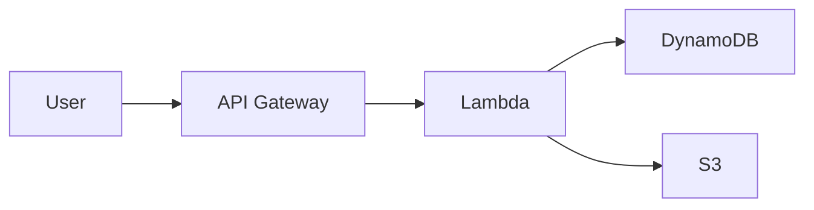

::title::
AWS Dark Theme

::subtitle::
A Professional Slidev Theme for AWS Presentations

::speaker::
Your Name (Pronouns)

Your Title

Your Company

<!--
This is the cover slide with AWS gradient background.
Use named slots for structured content.
-->

---
layout: section
---

# Section title

<!--
Section slides are great for dividing your presentation into major topics.
They feature a gradient background and large text.
-->

---
layout: default
---

# Default Layout

This is the standard content layout with:

- Clean black background
- Perfect for bullet points and text content
- Automatic footer with AWS logo and page number
- Supports all standard markdown formatting

You can add **bold text**, *italic text*, and `inline code`.

<!--
The default layout is your go-to for most content slides.
It includes automatic footer with logo and page numbers.
-->

---
layout: two-cols
---

# Two Columns Layout

Left column content:

- Feature A
- Feature B
- Feature C

Perfect for comparisons or side-by-side content.

::right::

# Right Column

Right column content:

- Benefit 1
- Benefit 2
- Benefit 3

Both columns are equal width.

<!--
Two-column layout is great for comparisons, before/after, or complementary content.
-->

---
layout: default
---

# Code Highlighting

Slidev supports beautiful code highlighting:

```typescript
// TypeScript example
interface User {
  id: number;
  name: string;
  email: string;
}

const user: User = {
  id: 1,
  name: 'John Doe',
  email: 'john@example.com'
};
```

Supports many languages: TypeScript, Python, Java, Go, Rust, and more!

<!--
Code blocks are automatically highlighted with Shiki.
Great for technical presentations.
-->

---
layout: default
---

# Gradient Text

Highlight important terms with <GradientText>gradient effects</GradientText>!

Available color schemes:

- <GradientText color="blue-green">Blue to Green</GradientText> (default)
- <GradientText color="blue-purple">Blue to Purple</GradientText>
- <GradientText color="orange-pink">Orange to Pink</GradientText>

Use it for <GradientText>key concepts</GradientText>, <GradientText color="blue-purple">product names</GradientText>, or <GradientText color="orange-pink">important terms</GradientText>.

<!--
GradientText component adds visual emphasis to important terms.
Choose colors that match your content.
-->

---
layout: center
---

# Center Layout

Perfect for section breaks or important announcements

Content is centered both horizontally and vertically

<!--
Center layout puts content in the middle with same styling as default.
Great for transitions or key messages.
-->

---
layout: intro
---

# Intro Layout

## Subtitle Goes Here

This layout is perfect for introducing new topics or sections. It provides a clean, focused presentation of your content with proper hierarchy.

Use it when you need more text than a section slide but want to maintain visual impact.

<!--
Intro layout is between section and default - more content than section, cleaner than default.
-->

---
layout: default
---

# Tables

Tables are fully supported:

| Feature | AWS Theme | Default Theme |
|---------|-----------|---------------|
| Dark Mode | ✅ | ❌ |
| Gradient Backgrounds | ✅ | ❌ |
| Custom Components | ✅ | ❌ |
| AWS Branding | ✅ | ❌ |

Tables automatically style with AWS colors.

<!--
Tables work great for comparisons and structured data.
-->

---
layout: default
---

# Diagrams with Mermaid



Mermaid diagrams use white lines and boxes. Keep them simple for best visibility.

<!--
Mermaid diagrams are styled with white lines and boxes.
Remember to use scale parameter to fit content.
-->

---
layout: default
---

# Math Equations

Inline math: $E = mc^2$

Block equations:

$$
\frac{d}{dx}\left( \int_{0}^{x} f(u)\,du\right)=f(x)
$$

Powered by KaTeX for beautiful mathematical notation.

<!--
LaTeX math support is built-in for technical and scientific presentations.
-->

---
layout: default
---

# Icons

Use Iconify icons easily:

- <carbon:checkmark class="text-green-400" /> Completed tasks
- <carbon:close class="text-red-400" /> Cancelled items  
- <carbon:arrow-right class="text-blue-400" /> Next steps
- <carbon:warning class="text-yellow-400" /> Important notes

Or use emoji: 🚀 ✅ ❌ 💡 📊 🔧

<!--
Icons add visual interest. Use carbon icons or emoji for best compatibility.
-->

---
layout: default
---

# UnoCSS Utilities

Slidev includes UnoCSS for styling:

<div class="grid grid-cols-3 gap-4 mt-8">
  <div class="p-4 bg-blue-500/20 rounded">
    Box 1
  </div>
  <div class="p-4 bg-green-500/20 rounded">
    Box 2
  </div>
  <div class="p-4 bg-purple-500/20 rounded">
    Box 3
  </div>
</div>

Use utility classes for quick styling without custom CSS.

<!--
UnoCSS provides Tailwind-like utilities for rapid styling.
-->

---
layout: default
---

# Additional Resources

[AWS Documentation](https://aws.amazon.com/documentation/)

[Slidev Documentation](https://sli.dev)

[Theme Repository](#)

<!--
Final slide with links and resources.
-->

---
layout: end
---

# Thank You !

Questions?

<!--
End layout provides a clean conclusion to your presentation.
-->